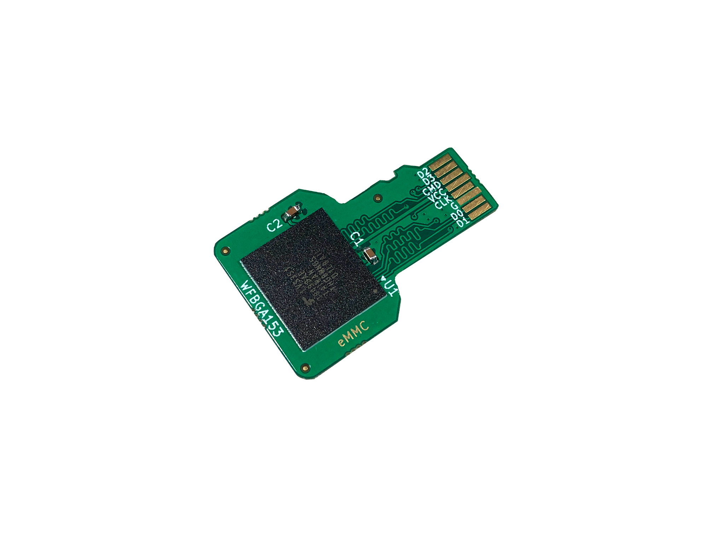

# eMMC WFBGA153 to microSD card adapter PCB
By default the Hantek TO11 (1832C) LCR meter only comes with a pair of short standard aligator clips. In order to perform more accurate measurements I built this 4 wire Kelvin connection test lead set with the proper clips where the top and bottom jaw are not electrically connected. The repository includes the source files for making the PCB that is used as the connection with the LCR meter as well as step files for 3d printing the enclosure of the connector.

### What else do you need?
Besides this custom designed PCB you will need a couple of bypass capacitors (0.1-1uF 10V or above in 0603 package) and the eMMC memory chip. eMMC chips in WFBGA153 package are available from every big distributor but if you would like to try your luck with some inexpensive options, check out [this link.](https://voltlog.com/y/pg8ny)

Alternatively you can order the PCB + enclosure from my [Tindie store](https://www.tindie.com/products/voltlog/emmc-wfbga153-to-microsd-card-adapter-set-of-2/).

More info about this project in [Voltlog #351](https://youtu.be/pFo1xvBqbqs).

